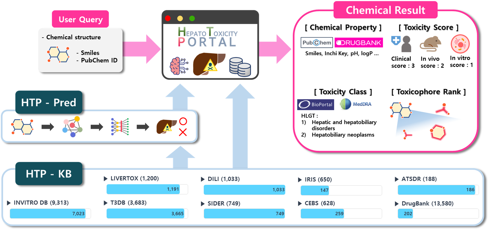

## HTP_Pred ##

This is the official implementation of HTP_Pred, a deep learning model for predicting hepatotoxicity trained on HTP_KB database.



You can access to the database and run the model prediction on the [HepatoToxicity Portal (HTP)](https://kobic.re.kr/htp/).

## Getting Started

### Installation

Set up conda environment and clone MolCLR github repository

```
# create a new environment
$ conda create --name htp_pred python=3.7
$ conda activate htp_pred

# install requirements
$ pip install torch==1.7.1+cu110 torchvision==0.8.2+cu110 -f https://download.pytorch.org/whl/torch_stable.html
$ pip install torch-geometric==1.6.3 torch-sparse==0.6.9 torch-scatter==2.0.6 -f https://pytorch-geometric.com/whl/torch-1.7.0+cu110.html
$ pip install PyYAML
$ conda install -c conda-forge rdkit=2020.09.1.0
$ conda install -c conda-forge tensorboard

# clone the source code of MolCLR github
$ git clone https://github.com/yuyangw/MolCLR.git
```

### Predicting hepatotoxicity

To predict hepatotoxicity with compound SMILES, first prepare the .csv file as like an example in `example/sample.csv`.
The configurations and detailed explanation for each variable can be found in `predict.yaml`.
```
$ python pred_htp.py predict.yaml
```

### Visualizing atomwise contribution

TBD